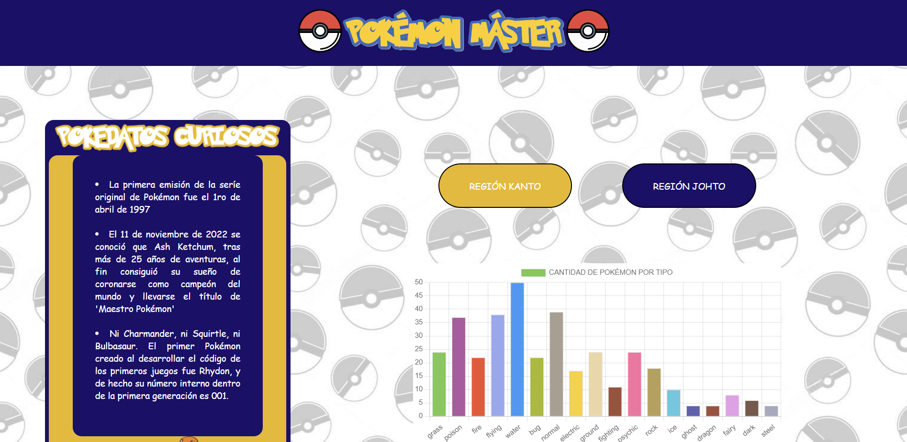
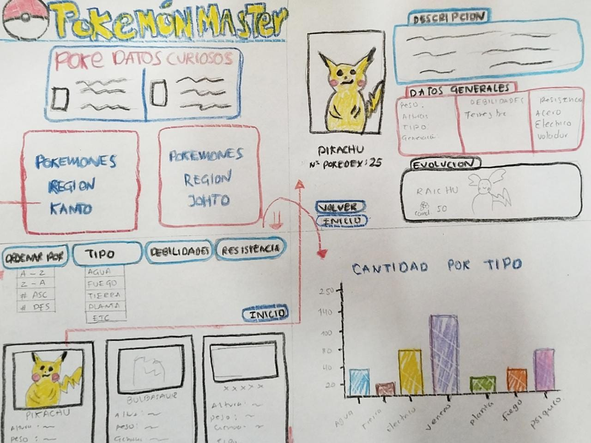
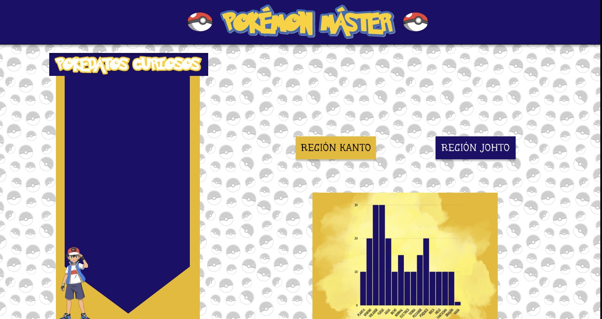
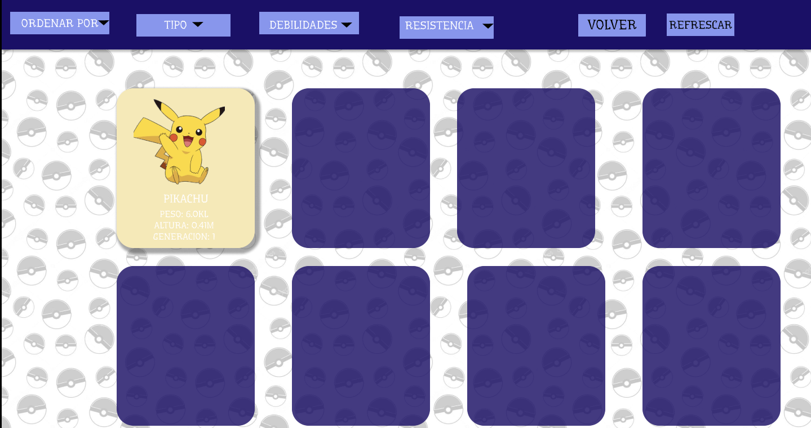
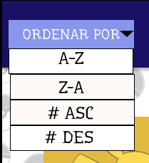
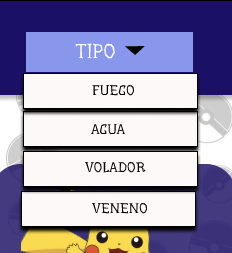
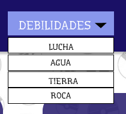
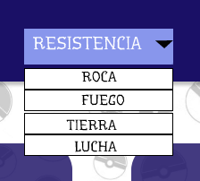

# Data Lovers - Pokémon Máster

[Aqui puedes ver el sitio Oficial](https://pq2505.github.io/DEV002-data-lovers/src/index.html)

# Índice

* [1. Definición del Proyecto](#1-definicion-del-proyecto)
* [2. Investigación UX](#2-investigación-ux)
* [3. Diseño UI](#3-diseño-ui)
* [4. Herramientas de elaboración](#4-herramientas-de-elaboracion)

***

## 1. Definición del Proyecto

Nuestro sitio web es una página pensada para los fans de Pokemón, quienes encontrarán información de los Pokémon que pueden usar para revisar antes de jugar batallas en el juego Pokémon Go y de esta forma hacer estrategias en sus combates luego de posiblemente ver las debilidades y fortalezas de los Pokémon en la presente Pagina Web.

## Imagen final de la Página Web:

***

## 2. Investigación UX

## 2.1 ¿Quiénes son los principales usuarios del producto?

Personas que en algún momento de su vida han escuchado hablar de Pokémon, quienes tal vez vieron alguna vez la serie, o quienes son Fans destacados por jugar Pokémon GO y va dirigida a todos pues es una página en la cual van a encontrar desde datos curiosos de la serie, así como también información de cada uno de los Pokémon, bien sea porque está interesado en conocerla por curiosidad o porque va a combatir en el Juego y quiere tener información a la mano para que su batalla sea la ganadora.

## 2.2 ¿Cuáles son los objetivos de estos usuarios en relación con el producto?

Conocer más a fondo la información de los Pokémon, pues nunca basta con lo que nos encontramos en una sola Página Web, siempre el usuario interesado en algun tema en especifico querrá encontrar mucha más información, así que nuestra Página está pensada de forma intuitiva para que en cada Card de los Pokémon se destaque la información más relevante y que a simple vista cumpla con lo que el usuario planea encontrar en un primer acercamiento con una Página Web Pokémon.

## 2.3 ¿Cuáles son los datos más relevantes que quieren ver en la interfaz y por qué?

Se espera visualizar los 251 Pokémon separados por regiones Kanto y Johto, con la información detallada de cada uno, usar filtros que le permitan encontrar con mayor facilidad lo que desea ver, porque son usuarios que buscan de manera rápida la información tal vez con la posibilidad de ganar sus batallas en los Gimnasios Pokémon hablando del juego, o porque simplemente el usuario nuevo quiere informarse de forma práctica y visual sobre esta Guía de Pokémon Máster.

## 2.4 ¿Cuándo utilizan o utilizarían el producto?

Mayormente se usaría cuando el usuario desee ver información importante antes de sus batallas Pokémon para conocer resistencias y debilidades de cada Pokémon. También se puede cuando el usuario está en un espacio de descanso u ocio y quiere por curiosidad ver algún dato de estos Pokémon.

***
## 3. Diseño UI
## 3.1 Prototipo de baja fidelidad

## 3.2 Testeo de Usabilidad
El testeo se realizó con usuario real y nos aportó algunos puntos que nos ayudaron a mejorar la visual de la página:

* Agregar botones de VOLVER para salir al inicio y elegir la otra región y REFRESCAR PÁGINA por si queria borrar filtros y hacer otros nuevos según lo que deseara ver en el momento.
* Simplificar la información a mostrar en las cards por cada Pokemon, queríamos incluir mucho, pero nos informó los puntos exactos que deberíamos mostrar para que fuera más efectiva dicha información.
* Los filtros a usar.

## 3.3  Prototipo de alta fidelidad

* Prototipo interactivo Figma: 
[FIGMA](https://www.figma.com/proto/EFCeqo3mXe1ESkwiGB4WnC/Untitled?node-id=1%3A2&starting-point-node-id=1%3A2)

***
## 3.4 Historias de Usuario

## Historia Uno

* Cómo: Fan de Pokémon.
* Quiero: Ver la página de inicio/Bienvenida
* Para: Poder ver datos curiosos y botones por regiones sin filtros.
* Criterios de Aceptación: 
Ser responsive 
Mostrar datos curiosos y los cuadros de Regiones que tendrá disponibles, sin filtros. 
Que cumpla con el diseño de alta fidelidad
* Definición de terminado: 
Que se vea la página de inicio. 
Que el código esté en el repositorio de Github. 
Que cumpla los criterios de aceptación. 
Que esté desplegada en Github Pages. 

## Historia Dos

* Cómo: Fan de Pokémon.
* Quiero: Ver la lista de Pokémon.
* Para: Saber cuales Pokémon están disponibles en las Regiones de Kanto y Johto.
* Criterios de Aceptación: 
Ser responsive 
Mostrar Pokémon enlistados en tarjetas, en columnas de cinco, con foto, nombre, número de Pokédex y tipo. 
Que sea Scroll 
Que cumpla con el diseño de alta fidelidad. 
* Definición de Terminado: 
Que se vea la lista de pokémon en tarjetas, en columnas de a 5. 
Cargar el código al repositorio de Github. 
Cumplir los criterios de aceptación. 
Desplegar en Github Pages. 
Que el README esté completo con el avance que se tiene. 
Contar con pruebas unitarias. 

## Historia Tres

* Cómo: Fan de Pokémon
* Quiero: Usar los filtros de Ordenar por y filtro de Tipo.
* Para: Facilitar la búsqueda de los Pokémon.
* Criterios de Aceptación: 
Que se pueda ordenar de la A-Z, Z-A 
Que se vea ordenado por # ascendente y por # descendente  
Que permita filtrar por tipo. 
Que sea Scroll 
Que sea responsive 
* Definición de Terminado: 
Cumplir los criterios de aceptación. 
Cargar el código al repositorio de Github. 
Desplegar en Github Pages. 
Que el README esté completo con el avance que se tiene. 
Contar con pruebas unitarias. 

## Historia Cuatro

* Cómo: Fan de Pokémon 
* Quiero: Usar los filtros de Resistencia y Debilidad
* Para: Conocer cada Pokémon según sus resistencias y Debilidades
* Criterios de Aceptación: 
Que se pueda filtrar por Resistencias y muestre enlistados los pokémon en tarjetas por columnas de a 5. 
Que se pueda filtrar por Debilidades y muestre enlistados los pokémon en tarjetas por columnas de a 5. 
Que sea Scroll 
Que sea responsive 
* Definición de Terminado: 
Que las funciones correspondientes estén en el main.js y que cumpla con los filtros definidos.  
Cargar el código al repositorio de Github. 
Desplegar en Github Pages. 
Que el README esté completo con el avance que se tiene. 
Contar con pruebas unitarias. 

## Historia Cinco

* Cómo: Fan de Pokémon 
* Quiero: Ver alguna estadística que me muestre la cantidad de Pokémon por tipo. 
* Para: Tener una visión unificada de las cantidades con las que cuenta el sitio web.
* Criterios de Aceptación: 
Que se muestre la gráfica con la información de cantidad de los Pokemon por tipo que se tienen  
Que sea responsive 
* Definición de Terminado: 
Que esté creada en el main.js la función para la gráfica a mostrar.
Que el README esté completo con el avance que se tiene. 
Contar con pruebas unitarias.

***
## 4. Herramientas de elaboración del proyecto
* HTML
* CSS
* JavaScript